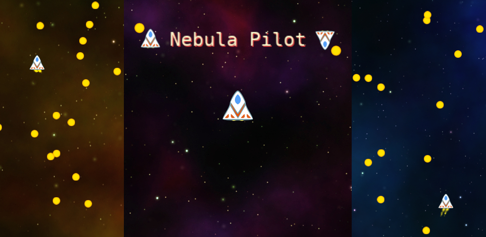

# Nebula Pilot

Nebula pilot is a casual game about surviving by avoid getting hit.

# History

This is the cultimation of my attemps to reproduce an old game about avoiding bullets.

Around year 2001 I was working in China and some coworkers showed me this small game (in Chinese) where you fly a space ship and you have to avoid some bullets, the tittle said somethine like: "If you are man, survive 20 seconds".

The first version was an Android only game using Java, It was almost finished but due to life had to switch my attention to other tasks. That version will be uploaded sometime later.

On 2016 I got free of my dutties and decided to finish several things I couldn't over the years while working on a company. This is the end result.

There is a newer version which included support for making different levels, but the development was taking too long already so, for now, it will stay like it is.

# Future

Althrough I had already done some more work for more versions, I decided it was a lot of work and would take long time to finish it, for this reason, the current version will stay like it is now and if there are modifications those would go to Nebula Pilot 2.

Random future ideas for Nebula Pilot 2:

* Different levels/stages: There is already some code done
* Different Ships
* Use nicer debril instead of circles

Random future ideaa for Nebula Pilot 3d:

* More or less same as 2 but done in 3d.

# License

Currently undecided, so for the moment [no license](http://choosealicense.com/no-license/).

# Game

This section describes how some of the parts of the game were made, where did the resources come from, etc.

## The Ship

The original ship was painted pixel by pixel with Gimp and later converted to svg using Inkscape.

The original collision detection between the balls and the ship was pixel perfect using a bitmask and a `shift` and `and` operation in the Java version... very nice, but **THE USERS** complained the ship some times exploded too easy... just by one pixel.

In Godot I used the physics engine and the collision detection is done by it (ship is a triangle, balls are circles) and I made the shapes a little bit smaller as to avoid the users complaining.

Using the godot physics engine found that sometimes the balls would bounce on the ship, this happened depending on the angle and the speed of collision, to fix this I changed the ship to be an area2d so it wouldn't be possible to bounce.

A special note is the thing where I expent *a lot of* time converting from the old java version to the Godot one was the thruster effect, I just couldn't make exactly the same effect using Godot particles, I got fixated on making it look good and ragequit after several days (this was on 2015). Direct code conversion was good, but I wanted to use as much Godot as possible.

One of the original ideas was to be able to create several different space ships, but as the task of creating the graphics took too much time I decided to just use the first one. I did fint some nice graphics for spaceships, but I used them in another game, currently unfinished.

## Background Stars

In the beginning the background was just some dots simulating starts, different dots would move at different speeds as to simulate more distance from the viewer, dots going out of the bottom of the screen would come in from the top at a new randomized loction and speed, this came directly from the java version of the game but didn't look so nice.

One day my son asked me if I changed the stars, it looked so real now, then he realized it was some dust on the phone, at that moment decided to change the backgrounds.

It tooke me a couple of days looking for nice pictures of space, I wanted something tileable and if possible something big so it wouldn't look so repetitive. After much searching, I found something interesting on [webtreats](http://webtreats.mysitemyway.com/tileable-classic-nebula-space-patterns/) and the license was interesting too...

Once I had some assets, I made a scene to encapsulate the logic:

* There are 8 different backgrounds which will be selected randomly and each will appear twice in each cycle of randomness, in worst case scenario the same background will be selected 4 times in a row (2 times at the end of cycle and 2 times at the beginning of next cycle).
* The background does scroll when the ship engines are on and, because it is tileable, it loops seamlessly.
* The background position is randomized at the start, so it is very difficult to see two times the same background.
* Background textures are loaded in a thread, this is because they are somewhat big and on a mobile phone it adds a noticeable pause/delay.

## Menu Buttons

Because I wanted to add several languages to the game and wanted to save on translations, I began looking for some generic buttons and UI elements that I could use on the menu without text.

I found [game-ui-simple-outline-circles](http://opengameart.org/content/game-ui-simple-outline-circles) which is in public domain and had all I needed but looked too simple, so I modified like this:

* Open with Gimp
* Duplicate layer
* Select top layer, Colors -> Colorify
* Select bottom layer, Colors -> Colorify
* Move bottom layer 2 pixels right and down
* Export as png

It took me several days to get the menu buttons right, the positions, the desired effects, I changed many times until the current one seemed nice enought.

## Highscore and Credits scenes

This two scenes needs special attention because are the only scenes which are localized in 3 languages: English, Spanish and Chinese.

Regarding the Chinese localization, because it is just a couple of places, I decided to just make pngs, and avoid the whole [font import](http://docs.godotengine.org/en/stable/tutorials/asset_pipeline/importing_fonts.html#internationalization).

In the process of doing the localization found a weird bug where the localized "tscn" files would be renamed to "_converted.scn" or similar and this would fail, because Godot was looking for the "name.scn" only. To fix this problem the simple way for me was to use "scn" files for the localized ones and tscn for the main one.

I didn't report the problem at that time because it would have taken a lot of precious time, so I added it to my LINO (Last-In Never-Out) list for the future.

## SoundPlayer

At the beginning, each scene had its own sounds, but there were not much control, so if many debrils hit the shield the sound could get loud. To be able to control the sounds better, for example, limiting the number of simultaneous voices and easy configuration on the editor. The sound player is autoloaded and is a global singleton.

Regarding the sounds, I expent long time searching for nice sounds, and nothing seemed good, at the end:

* shield-hit: I made this with Audacity.
* thrust sound: I cut a loopable second from [engine-sound](http://opengameart.org/content/engine-sound)
* ship explosion: [muffled-distant-explosion](http://opengameart.org/content/muffled-distant-explosion) maybe I processed a little.
* debril explosion: I cut a little bit of the beginning of [DeathFlash](http://opengameart.org/content/big-explosion)

## Music

A game would be incomplete if it didn't have music. Once I decide to add it I expend long time trying to find some music to add to the game.

After two or three days I got tired of searching and decided to make it myself, it wouldn't be as nice but I would get it done. So I powered up the iMac, updated the system, started GarageBand 10... It took me around a week to make the 3 songs.

The Music system has:

* Loopable songs
* Randomized song sequence
* Each song will play twice each cycle, this is the same system as the Background Stars randomization.
* Songs are started in a thread because it caused a noticeable pause on mobile phones.

## Publishing the game

This task takes A LOOOOOOT of time, each market has different requirements: picture sizes, videos, descriptions.

I tried the following:

### Google Play

This one was easy: paid the money, made some screenshots, a couple of videos upload everything and more or less was done.

### Tencent's Yingyongbao 

This one was a little bit more difficult, mainly due to the language.

I already had a QQ account but I needed to make the "real name check" or something like that which requires you to send a photo of yourself with the passport, and something else... not big problem, I hired a helper... my son, haha.

My son helped me by writting the game description, and a little bit of translation and tests. After a few hours the game was up and running.

[Nebula Pilot on Yingyongbao](http://android.myapp.com/myapp/detail.htm?apkName=com.aaronps.nebulapilot)

### Xiaomi store

Because my son had a Xiaomi phone and I could test the game there I thought to upload the game to their [store](http://dev.xiaomi.com) (in Chinese).

This one gave me some more problems when registering because the pictures of me and the passport didn't look good.

Uploading the game required new set of pictures and videos using "their sizes", and had to make 5 new icons for them because the icons also has special requirements.

I uploaded the game twice but they use automatic test using "monkey" and godot crashed twice, I tried to reproduce and maybe fixit, but after the second upload it seems they just ignored the request, it has been in "auditing" mode for months.

Anyway my son sold his phone, so ignore them.

### Apple Store

I build the game for iOS too and tested in iPhone 4S and iPad mini 2, but I didn't make all the preparations to put on the apple store, maybe next time.

### Others

I registered in app.baidu.com too, but they have a lot of legal documents to read which I do not understand, for example, I don't know if I need to have a company or not to upload the application there, so I just stopped here.

# Working with Godot

I think working with Godot was good:

* Nice moving elements around with the mouse
* Quick tests both in computer and mobile
* Integrated tool for almost everything needed
* BAD: some bugs which I haven't reported...

